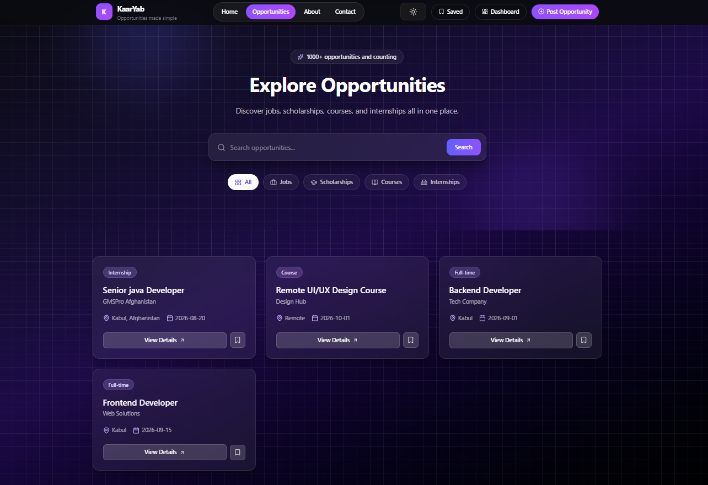
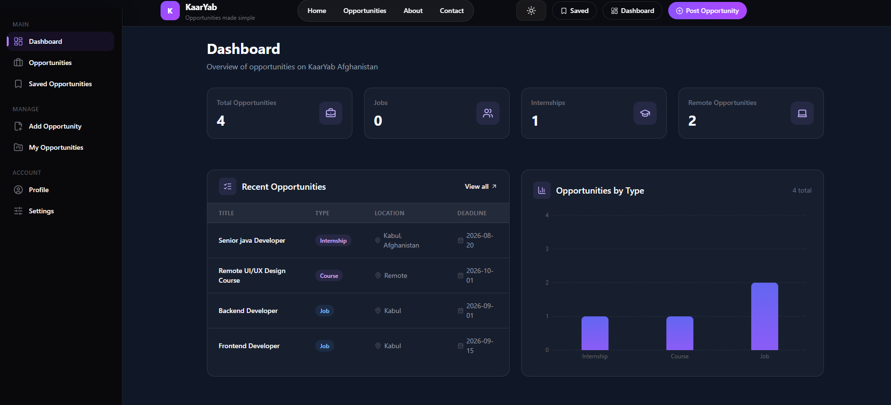
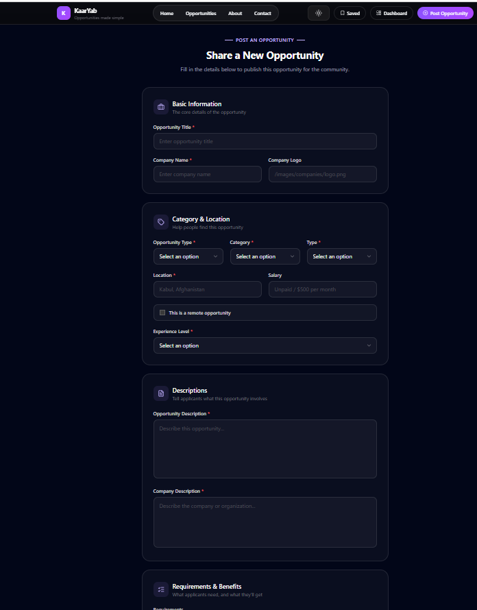

# KaarYab Afghanistan 🇦🇫

## Project Description

KaarYab Afghanistan is an opportunity finder platform designed to help Afghan youth discover useful opportunities such as jobs, internships, scholarships, online courses, and remote work opportunities.

The platform provides an easy way for users to search, filter, save, and explore different opportunities in one place.

---

## Problem It Solves

Many young people in Afghanistan struggle to find reliable information about jobs, internships, scholarships, and learning opportunities.

KaarYab solves this problem by collecting opportunities in one platform and making them easier to discover through search and filtering features.

---

## Features

- Browse available opportunities
- Search opportunities by title and keywords
- Filter opportunities by type and category
- View detailed opportunity pages
- Save favorite opportunities
- Add new opportunities
- Edit and delete opportunities (CRUD operations)
- Dashboard with opportunity statistics
- Charts and data visualization
- Responsive design for desktop and mobile
- Dark mode support
- Loading and error states
- Form validation

---

## Technologies Used

### Frontend

- Next.js
- React
- TypeScript
- Tailwind CSS
- React Hooks
- React Hook Form
- Zod Validation
- Recharts
- Lucide React Icons

### Backend / Data

- Next.js API Routes
- JSON Data Storage
- REST API concepts

### Tools

- Git & GitHub
- Vercel Deployment
- VS Code

---

## How to Run Locally

### 1. Clone the repository

```bash
git clone https://github.com/YOUR_USERNAME/YOUR_REPOSITORY_NAME.git


## Live Demo Link

🔗 https://kaaryab-youth-gyld9s87r-zahra-m-projects6.vercel.app/


## Screenshots

### Home Page


### Opportunities Page



### Dashboard



### Add Opportunity Form

